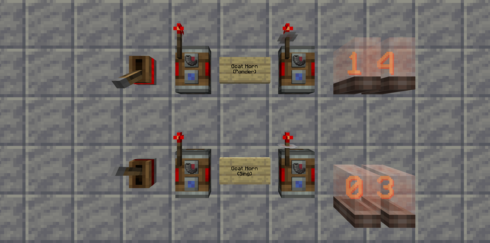

# Create: Strict Links
Makes the [Create Mod](https://modrinth.com/mod/create) Redstone Link frequencies take NBT into account, allowing for more frequency diversity and even password protection via written books.

 

## Installation:
You can visit the [releases page](https://github.com/the-drunken-cod/Create-Strict-Links/releases), the [TODO: Modrinth page](), or the [TODO: CurseForge page]() to download the latest version of the mod.  
Then simply place the downloaded JAR file into your Minecraft `mods` folder and launch the game with NeoForge.  

> [!NOTE]  
> You will need [NeoForge](https://neoforge.dev/) installed to run the mod.  
> An easy way of doing this is by creating a modded game instance in a launcher like [ATLauncher](https://atlauncher.com/) or [MultiMC.](https://multimc.org/)

 

## Attribution:
- Created from the template [jaredlll08/MultiLoader-Template.](https://github.com/jaredlll08/MultiLoader-Template)  
  Changes:
  - Added build and release GitHub Actions workflows.
  - Added VS Code settings and debug launch configurations.
  - Added base config services for NeoForge.
  - Added a base registry helper for NeoForge.
  - Added base datagen services for NeoForge.

 

## License:
This project is licensed under the AGPL-3.0-or-later License.  
See the [`LICENSE.txt` file](https://github.com/the-drunken-cod/Create-Strict-Links/blob/develop/LICENSE.txt) for details.

 

## Disclaimers:
NOT AN OFFICIAL MINECRAFT PRODUCT. NOT APPROVED BY OR ASSOCIATED WITH MOJANG OR MICROSOFT.  
  
THE SOFTWARE IS PROVIDED "AS IS", WITHOUT WARRANTY OF ANY KIND, EXPRESS OR IMPLIED, INCLUDING BUT NOT LIMITED TO THE WARRANTIES OF MERCHANTABILITY, FITNESS FOR A PARTICULAR PURPOSE AND NONINFRINGEMENT. IN NO EVENT SHALL THE AUTHORS OR COPYRIGHT HOLDERS BE LIABLE FOR ANY CLAIM, DAMAGES OR OTHER LIABILITY, WHETHER IN AN ACTION OF CONTRACT, TORT OR OTHERWISE, ARISING FROM, OUT OF OR IN CONNECTION WITH THE SOFTWARE OR THE USE OR OTHER DEALINGS IN THE SOFTWARE.
